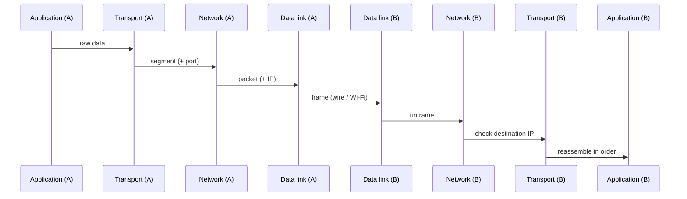

# TaiLieuCyberSecurityCoBan

-----------------------------------------------------------------------------

# Networking Fundamentals

> Notes on OSI/TCP-IP model, IP/Subnetting, DNS, HTTP/HTTPS, and TCP vs UDP.
> *Ghi chú về mô hình OSI/TCP-IP, IP/Subnet, DNS, HTTP/HTTPS và TCP vs UDP.*

## Table of contents

- [1. OSI / TCP-IP model & packet journey](#1-osi--tcp-ip-model--packet-journey)
- [2. TCP vs UDP](#2-tcp-vs-udp)
- [3. IP addressing & subnetting](#3-ip-addressing--subnetting)
- [4. DNS](#4-dns)
- [5. HTTP vs HTTPS](#5-http-vs-https)

---

## 1. OSI / TCP-IP model & packet journey

The OSI model has 7 layers, but in practice the simplified **TCP/IP model** with 4 layers is what you'll actually work with:

| Layer | Role | Example protocols |
|---|---|---|
| Application | Where the actual data is created/read | HTTP, DNS, SSH |
| Transport | Splits data into segments, attaches ports | TCP, UDP |
| Network | Attaches source/destination IP, routing | IP |
| Data Link / Physical | Frames the data, sends it as electrical/radio signal | Ethernet, Wi-Fi |

> *Mô hình OSI có 7 lớp, nhưng thực tế người ta hay dùng mô hình TCP/IP rút gọn còn 4 lớp. Application là nơi tạo/đọc dữ liệu thật. Transport chia nhỏ dữ liệu và gắn port. Network gắn địa chỉ IP nguồn/đích và định tuyến. Data Link/Physical đóng gói thành frame rồi phát thành tín hiệu điện/sóng.*

When machine A sends data to machine B, the data travels **down** through these 4 layers (each layer adds its own header — this is called **encapsulation**), gets transmitted over the wire/Wi-Fi, then travels **up** through the same 4 layers on machine B to be reassembled (**decapsulation**).

> *Khi máy A gửi dữ liệu cho máy B, dữ liệu đi **xuống** qua 4 lớp (mỗi lớp gắn thêm header riêng — gọi là **encapsulation**), truyền qua dây/wifi, rồi đi **lên** qua 4 lớp ở máy B để ráp lại (**decapsulation**).*

*Each arrow = one layer handing data to the next. Going down on A = **encapsulation** (adding headers), going up on B = **decapsulation** (stripping headers).*

> *Mỗi mũi tên là một lớp chuyển dữ liệu cho lớp kế tiếp. Đi xuống ở máy A là **encapsulation** (gắn thêm header), đi lên ở máy B là **decapsulation** (bóc header ra).*

---

## 2. TCP vs UDP

| | TCP | UDP |
|---|---|---|
| Handshake | 3-way handshake (SYN → SYN-ACK → ACK) before sending | No handshake, sends directly |
| Reliability | Guarantees delivery + correct order (retransmits lost packets) | No guarantee — packets may be lost or out of order |
| Speed | Slower (overhead from handshake + acknowledgments) | Faster (minimal overhead) |
| Typical use | Web browsing, email, file transfer | Video calls, online games, live streaming |

> *TCP bắt tay 3 bước trước khi gửi, đảm bảo dữ liệu đến đủ và đúng thứ tự nhưng chậm hơn — dùng cho web, email. UDP gửi thẳng không bắt tay, không đảm bảo đến nơi, nhưng nhanh hơn — dùng cho video call, game, vì thà mất vài gói còn hơn bị delay.*

---

## 3. IP addressing & subnetting

An IP address (e.g. `192.168.1.10`) is a device's "home address" on a network. A **subnet mask** (e.g. `/24` or `255.255.255.0`) splits that address into a **network part** and a **host part** — this is how a router decides whether a packet stays inside the local network or needs to go out.

`/24` means the first 24 bits identify the network, leaving 8 bits for hosts → up to 2⁸ − 2 = **254 usable host addresses** (subtracting the network address and the broadcast address).

> *Địa chỉ IP là "địa chỉ nhà" của thiết bị trong mạng. Subnet mask (vd `/24`) chia địa chỉ đó thành phần network và phần host — nhờ đó router biết gói tin nên ở lại mạng nội bộ hay phải đi ra ngoài. `/24` nghĩa là 24 bit đầu xác định network, 8 bit còn lại cho host, cho ra tối đa 254 địa chỉ host dùng được.*

---

## 4. DNS

**DNS (Domain Name System)** translates human-readable domain names (`google.com`) into the real IP address a computer needs to route packets — because computers only understand IP addresses, not domain names. Think of it as a phone book for the internet.

> *DNS dịch tên miền dễ nhớ (`google.com`) thành địa chỉ IP thật, vì máy tính chỉ hiểu IP chứ không hiểu tên miền — giống như một cuốn danh bạ điện thoại của internet.*

---

## 5. HTTP vs HTTPS

Both operate at the Application layer and follow the same request/response model. The core difference: **HTTPS encrypts the data with TLS before it's handed down to the Transport layer**, while HTTP sends everything as plaintext. This means anyone intercepting HTTPS traffic in transit cannot read the actual content.

> *Cả hai đều hoạt động ở lớp Application, cùng theo mô hình request/response. Khác biệt cốt lõi: **HTTPS mã hoá dữ liệu bằng TLS** trước khi gửi xuống lớp Transport, còn HTTP gửi dữ liệu trần (plaintext). Vì vậy ai chặn được gói tin HTTPS giữa đường cũng không đọc được nội dung thật.*

---

*Notes by [karsirdev](https://github.com/karsirdev) — part of a cybersecurity fundamentals learning path.*
